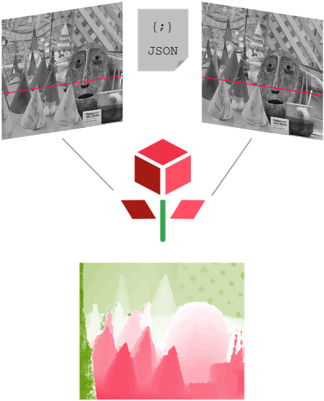

Getting started
===============

Overview
########

From stereo rectified images to disparity map

Pandora aims at shortening the path between a stereo-matching prototype and its industrialized version.
By providing a modular pipeline inspired from the [Scharstein2002]_ taxonomy, it allows one to emulate, analyse and hopefully improve state of the art stereo algorithms with a few lines of code.

We (CNES) have actually been using Pandora to create the stereo matching pipeline for the CNES & Airbus `CO3D <https://co3d.cnes.fr/en/co3d-0>`_ off board processing chain.
Leaning on Pandora's versatility and a fast-paced constantly evolving field we are still calling this framework a work in progress !

Install
#######

Pandora is available on Pypi and can be installed by:

.. code-block:: bash

    pip install pandora #for the latest official release

For stereo reconstruction we invite you to install pandora **and** the required plugins using instead the following shortcut:

.. code-block:: bash

    pip install pandora[sgm]
    pip install pandora[mccnn]

First step
##########

Pandora requires a `config.json` to declare the pipeline and the stereo pair of images to process. Use our data_sample.zip to start right away !

.. code-block:: bash

    pip install pandora #install pandora latest release
    wget https://raw.githubusercontent.com/CNES/Pandora/master/data_samples/images/cones.zip  # input stereo pair
    wget https://raw.githubusercontent.com/CNES/Pandora/master/data_samples/json_conf_files/a_local_block_matching.json # configuration file
    unzip cones.zip #uncompress data
    pandora a_local_block_matching.json output_dir #run pandora

Customize
#########

To create you own stereo matching pipeline and choose among the variety of algorithms we provide, please consult :ref:`userguide`

You will learn:

 * which stereo matching steps you can use and combine
 * how to quickly set up a Pandora pipeline
 * how to add your own private algorithms to customize your Pandora Framework
 * how to use Pandora API (see `CARS <https://github.com/CNES/CARS>`_ for real life exemple)

Credits
#######

Pandora uses `transitions <https://github.com/pytransitions/transitions>`_ to manage the pipelines one can create.
Images I/O are provided by `rasterio <https://github.com/mapbox/rasterio>`_ and we use `xarray <https://github.com/pydata/xarray>`_
to handle 3D Cost Volumes with few `numba <https://github.com/numba/numba>`_ optimisations.

Our data test sample is based on the 2003 Middleburry dataset [Scharstein2003]_.

.. [Scharstein2002] D. Scharstein & R. Szeliski, 2002). Scharstein, D., & Szeliski, R. (2002). A taxonomy and evaluation of dense two-frame stereo correspondence algorithms. International journal of computer vision, 47(1-3), 7-42.
.. [Scharstein2003] D. Scharstein & R. Szeliski, 2003). Scharstein, D., & Szeliski, R. (2003, June). High-accuracy stereo depth maps using structured light. In 2003 IEEE Computer Society Conference on Computer Vision and Pattern Recognition, 2003. Proceedings. (Vol. 1, pp. I-I). IEEE.

Related
#######

* `Plugin_LibSGM <https://github.com/CNES/pandora_plugin_libsgm>`_ - Stereo Matching Algorithm plugin for Pandora
* `Plugin_MC-CNN <https://github.com/CNES/Pandora_plugin_mccnn>`_ - MC-CNN Neural Network plugin for Pandora
* `CARS <https://github.com/CNES/CARS>`_ - CNES 3D reconstruction software

References
##########

Please cite the following paper when using Pandora:

*Cournet, M., Sarrazin, E., Dumas, L., Michel, J., Guinet, J., Youssefi, D., Defonte, V., Fardet, Q., 2020. Ground-truth generation and disparity estimation for optical satellite imagery. ISPRS - International Archives of the Photogrammetry, Remote Sensing and Spatial Information Sciences.*