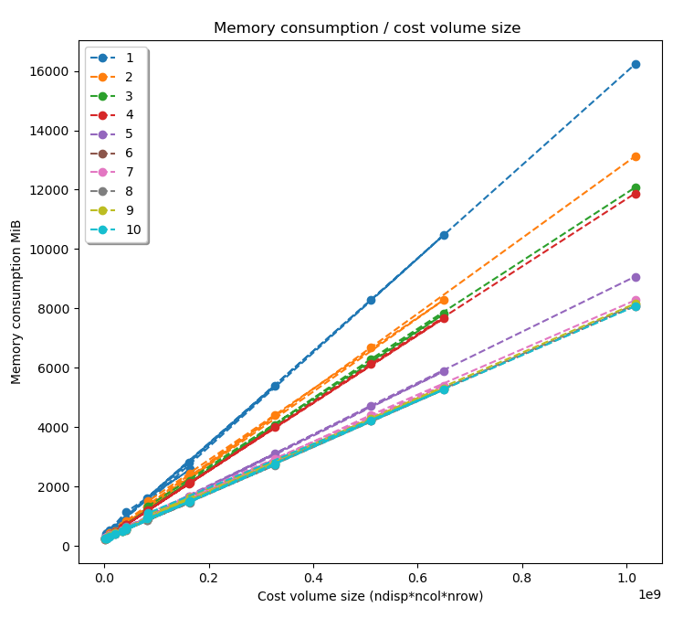

.. _outputs:

Outputs
=======

Pandora will store several data in the output folder, the tree structure is defined in the file
pandora/output_tree_design.py.

Memory consumption estimation
*****************************

Pandora can give an estimation of the memory consumption of a given pipeline without running it.

The memory consumption estimation is obtained given the following graph, which shows the memory consumption of the
10 most consuming or used Pandora's functions in respect of the size of the cost volume in MiB, defined as :
:math:`nbpix_x * nbpix_y * nbdisps`

Being the functions :

1. Mc_cnn.run_mc_cnn_fast/accurate

2. Plugin_libsgm.optimize_cv

3. Aggregation.cost_volume_aggregation cbca

4. Matching_cost.compute_cost_volume sd/sad

5. Disparity.mask_invalid_variable_disparity_range/to_disp

6. Cost_volume_confidence.confidence_prediction ambiguity/std_intensity

7. Validation.Interpolated_disparity sgm

8. Matching_cost.compute_cost_volume census

9. Filter.bilateral_kernel

10. Matching_cost.compute_cost_volume zncc

The equation of each function's consumption has been obtained and since the maximum memory consumption of a pipeline is defined by its most consuming function, Pandora just needs to find
the first function in the list that is present in the pipeline to estimate the pipeline's memory consumption.

Saved images
************

- *left_disparity.tif*, *right_disparity.tif* : disparity maps in left and right image geometry.

- *left_validity_mask.tif*, *right_validity_mask.tif* : the :ref:`validity_mask` in left image geometry, and
  right. Note that bits 4, 5, 8 and 9 can only be calculated if a validation step is set.

- *left_confidence_measure.tif*, *right_confidence_measure.tif* : multi-band image, each band represents a confidence measurement, depending on what is activated.

    - Standard deviation of pixel intensity inside matching cost window. see :ref:`cost_volume_confidence`. This band is named *stereo_pandora_intensityStd*.
    - Ambiguity measurement, see :ref:`cost_volume_confidence`. This band is named *ambiguity_confidence*.
    - Mininum and maximum risk measurement, see :ref:`cost_volume_confidence`. Those bands are named *risk_min_confidence* and *risk_max_confidence*.
    - Number of SGM paths that give the same final disparity if SGM and its option activated, see :ref:`plugin_libsgm`. This band is named *optimization_pluginlibSGM_nbOfDisp*.
    - Left-right distance following cross checking method, see :ref:`validation`. This band is named *validation_pandora_distanceOfDisp*.

.. note::
    Right products are only available if a *right_disp_map* parameter is activated and not equal to none.
    Must be the first key of *pipeline*.

+-----------------+---------------------------------------------+--------+---------------+--------------------------------+----------+
| Name            | Description                                 | Type   | Default value | Available value                | Required |
+=================+=============================================+========+===============+================================+==========+
| *method*        | Method to compute the right disparity map   | string |   none        | "none", "accurate"             | Yes      |
+-----------------+---------------------------------------------+--------+---------------+--------------------------------+----------+

Method value meaning:

- *none*: the right disparity map is not calculated.
- *accurate*: the right disparity map is calculated following the same pipeline as for the left disparity map, by inverting input images. The left one becomes the right one, the right one becomes the left one.

Example
*******

.. sourcecode:: text

    {
      "input" : {
            ...
      },
      "pipeline" :
       {
            "right_disp_map":
            {
                "method": "accurate",
            }
            ...
        }
    }

.. _validity_mask:

Validity mask
*************

Validity mask indicates why a pixel in the image is invalid and
provide information on the reliability of the match. These masks are 16-bit encoded: each bit
represents a rejection / information criterion (= 1 if rejection / information, = 0 otherwise):

 +---------+------------------+--------------------------------------------------------------------------------------------------+
 | **Bit** |    **Binary**    | **Description**                                                                                  |
 +---------+------------------+--------------------------------------------------------------------------------------------------+
 |         |                  | The point is invalid, there are two possible cases:                                              |
 |         |                  |                                                                                                  |
 |    0    | 0000000000000001 |   - border of left image                                                                         |
 |         |                  |   - nodata of left image                                                                         |
 +---------+------------------+--------------------------------------------------------------------------------------------------+
 |         |                  | The point is invalid, there are two possible cases:                                              |
 |         |                  |                                                                                                  |
 |    1    | 0000000000000010 |   - Disparity range does not permit to find any point on the right image                         |
 |         |                  |   - nodata of right image                                                                        |
 +---------+------------------+--------------------------------------------------------------------------------------------------+
 |    2    | 0000000000000100 | Information : disparity range cannot be used completely , reaching border of right image         |
 +---------+------------------+--------------------------------------------------------------------------------------------------+
 |    3    | 0000000000001000 | Information: calculations stopped at the pixel stage, sub-pixel interpolation was not successful |
 |         |                  | (for vfit: pixels d-1 and/or d+1 could not be calculated)                                        |
 +---------+------------------+--------------------------------------------------------------------------------------------------+
 |    4    | 0000000000010000 | Information : filled occlusion                                                                   |
 +---------+------------------+--------------------------------------------------------------------------------------------------+
 |    5    | 0000000000100000 | Information : filled mismatch                                                                    |
 +---------+------------------+--------------------------------------------------------------------------------------------------+
 |    6    | 0000000001000000 | The point is invalid: invalidated by the validity mask associated to the left image              |
 +---------+------------------+--------------------------------------------------------------------------------------------------+
 |    7    | 0000000010000000 | The point is invalid: right positions to be scanned invalidated by the mask of the right image   |
 +---------+------------------+--------------------------------------------------------------------------------------------------+
 |    8    | 0000000100000000 | The point is invalid: point located in an occlusion area                                         |
 +---------+------------------+--------------------------------------------------------------------------------------------------+
 |    9    | 0000001000000000 | The point is invalid: mismatch                                                                   |
 +---------+------------------+--------------------------------------------------------------------------------------------------+
