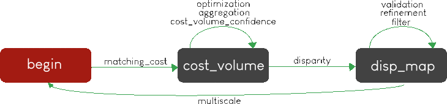
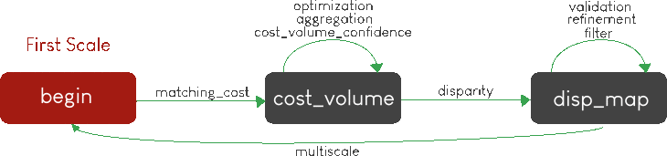

.. _Sequencing:

Sequencing
==========

Pandora will check if the requested steps sequencing is correct following the permitted
transition defined by the Pandora Machine (`transitions <https://github.com/pytransitions/transitions>`_)

Pandora Machine defines 3 possible states:
 - begin
 - cost_volume
 - disparity_map

and 9 transitions, each one corresponding to a stereo step described in :ref:`step_by_step` chapter:
 - matching_cost (:ref:`matching_cost`)
 - aggregation (:ref:`cost_aggregation`)
 - optimization (:ref:`optimization`)
 - confidence (:ref:`cost_volume_confidence`)
 - disparity (:ref:`disparity`)
 - filter (:ref:`filter`)
 - refinement (:ref:`disparity_refinement`)
 - validation (:ref:`validation`)
 - multiscale (:ref:`multiscale`)

Pandora machine starts at the begin state. To go from a state to another one, transitions are called and triggered
by specific name. It corresponds to the name of Pandora steps you can write in configuration file.

The following diagram highligts all states and possible transitions.

    .. figure:: ../Images/Machine_state_diagram.png

A transition (i.e a pandora's step) can be triggered several times. You must respect the following
naming convention: *stepname.xxx*  where *xxx* can be the string you want.
See :ref:`multiple_filters_example` for an example with multiple usage of filter transition.

**The most important thing to remember is to build your configuration file following the previous diagram by using transition name on pipeline section of your file.**

.. note::
    The only step of *pipeline* key configuration file that does not depend on machine state is the *right_disp_map* step (see :ref:`outputs`). This one, if needed, must be written
    at the top of *pipeline* section as shown in :ref:`right_map_example`.

If you want to understand in more details how Pandora machine works, please consult our `Pandora machine state tutorial notebook <https://github.com/CNES/Pandora/tree/master/notebooks/...>`_.

Examples
********

SSD measurment and filtered disparity map
#########################################

Configuration to produce a disparity map, computed by SSD method, and filterd by
median filter method.

.. sourcecode:: text

    {
        "input":
        {
            "left_mask": null,
            "right_mask": null,
            "disp_min_right": null,
            "disp_max_right": null,
            "img_left": "img_left.png",
            "img_right": "img_left.png",
            "disp_min": -100,
            "disp_max": 100
        },
        "pipeline":
        {
            "matching_cost":
            {
                "matching_cost_method": "ssd",
                "window_size": 5,
                "subpix": 1
            },
            "disparity":
            {
                "disparity_method": "wta",
                "invalid_disparity": "NaN"
            },
            "filter":
            {
                "filter_method": "median"
            }
        }
    }

.. _right_map_example:

SSD measurment ,filtered disparity map and compute right map
############################################################

The same configuration as the previous example but right disparity map is also computed.

.. sourcecode:: text

    {
        "input":
        {
            "left_mask": null,
            "right_mask": null,
            "disp_min_right": null,
            "disp_max_right": null,
            "img_left": "img_left.png",
            "img_right": "img_left.png",
            "disp_min": -100,
            "disp_max": 100
        },
        "pipeline":
        {
            "right_disp_map":
            {
              "method": "accurate"
            },
            "matching_cost":
            {
                "matching_cost_method": "ssd",
                "window_size": 5,
                "subpix": 1
            },
            "disparity":
            {
                "disparity_method": "wta",
                "invalid_disparity": "NaN"
            },
            "filter":
            {
                "filter_method": "median"
            }
        }
    }

An impossible sequencing
########################

.. sourcecode:: text

    {
        "input":
        {
            "left_mask": null,
            "right_mask": null,
            "disp_min_right": null,
            "disp_max_right": null,
            "img_left": "img_left.png",
            "img_right": "img_left.png",
            "disp_min": -100,
            "disp_max": 100
        },
        "pipeline":
        {
            "matching_cost":
            {
                "matching_cost_method": "ssd",
                "window_size": 5,
                "subpix": 1
            },
            "filter":
            {
                "filter_method": "median"
            }
            "disparity":
            {
                "disparity_method": "wta",
                "invalid_disparity": "NaN"
            },
            "filter":
            {
                "filter_method": "median"
            }
        }
    }

With this configuration, you receive the following error

.. sourcecode:: text

    Problem during Pandora checking configuration steps sequencing. Check your configuration file.
    (...)
    transitions.core.MachineError: "Can't trigger event filter from state cost_volume!"

Before the start, Pandora Machine is in the "begin" state. The configuration file defines *matching_cost* as
the first step to be triggered. So, Pandora Machine go from *begin* state to *cost_volume* state.
Next, the *filter* is going to be triggered but this is not possible. This step can be triggered only
if the Pandora Machine is in *disp_map*.

.. _multiple_filters_example:

Same step, multiple times
#########################

.. sourcecode:: text

    {
        "input": {
            "left_mask": null,
            "right_mask": null,
            "disp_min_right": null,
            "disp_max_right": null,
            "img_left": "img_left.png",
            "img_right": "img_left.png",
            "disp_min": -100,
            "disp_max": 100
        },
        "pipeline":
        {
            "matching_cost":
            {
                "matching_cost_method": "ssd",
                "window_size": 5,
                "subpix": 1
            },
            "disparity":
            {
                "disparity_method": "wta",
                "invalid_disparity": "NaN"
            },
            "filter.1":
            {
                "filter_method": "median"
            }
            "filter.2":
            {
                "filter_method": "bilateral"
            }
        }
    }

Multiscale
#########################################

Configuration to produce a disparity map, computed by SSD method with mutliscale processing (3 scales)

.. sourcecode:: text

    {
        "input":
        {
            "left_mask": null,
            "right_mask": null,
            "disp_min_right": null,
            "disp_max_right": null,
            "img_left": "img_left.png",
            "img_right": "img_left.png",
            "disp_min": -100,
            "disp_max": 100
        },
        "pipeline":
        {
            "matching_cost":
            {
                "matching_cost_method": "ssd",
                "window_size": 5,
                "subpix": 1
            },
            "disparity":
            {
                "disparity_method": "wta",
                "invalid_disparity": "NaN"
            },
            "multiscale": {
                "multiscale_method": "fixed_zoom_pyramid",
                "num_scales": 3
            }
        }
    }

