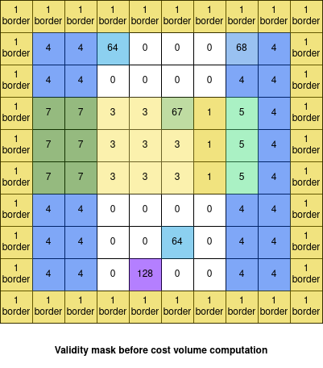

.. _criteria:

Validity criteria
=================

Pandora uses 12 criteria to invalidate pixels that cannot be computed or to identify particular pixels. 
There are two types of criteria : 

- **Invalidity criteria** : the pixel is invalid and cannot be computed.
- **Information criteria** : the pixel is valid, the criteria gives informations on the reliability of the match. 

These criteria are 16-bit encoded. Each bit represents a certain criteria and is equal to 1 if the
criteria is raised and 0 otherwise. 

.. list-table:: Criteria values
   :widths: 5 19 19 65
   :header-rows: 1

   * - **Criteria**
     - **Value in validity mask**
     - **Invalidity or information**
     - **Name in Pandora**
   * - 0
     - 2⁰ = 1
     - Invalidity 
     - left no data or border
   * - 1
     - 2¹ = 2
     - Invalidity 
     - right no data or disparity range missing
   * - 2
     - 2² = 4
     - Information 
     - right incomplete disparity range 
   * - 3
     - 2³ = 8
     - Information 
     - stopped interpolation 
   * - 4
     - 2⁴ = 16
     - Information 
     - filled occlusion
   * - 5
     - 2⁵ = 32
     - Information 
     - filled mismatch
   * - 6
     - 2⁶ = 64
     - Invalidity  
     - invalid in left mask
   * - 7
     - 2⁷ = 128
     - Invalidity  
     - invalid in right mask
   * - 8
     - 2⁸ = 256
     - Invalidity 
     - pixel occlusion
   * - 9
     - 2⁹ = 512
     - Invalidity 
     - pixel mismatch
   * - 10
     - 2¹⁰ = 1024
     - Information 
     - filled no data
   * - 11
     - 2¹¹ = 2048
     - Information
     - pixel interval regularized

These criteria are stored in a Xarray.DataArray `validity_mask` in cost volume and disparity map Xarray.Datasets.
The `validity_mask` is the same size as the left image.  

Criteria can be linked to user configuration, disparity range, or mismatch and occlusion for instance. 

Criteria are computed in different steps of the Pandora machine :

- Matching cost 
- Refinement 
- Filter
- Validation   
- Multiscale process

.. note::  The criteria are cumulative, i.e. several bits can be set for each pixel, except on the edges of the image.

Criteria raised in matching cost step
*************************************

Criteria 0, 1, 2, 6, and 7 are computed during the matching cost step because the cost volume cannot be computed
for some points. 
In this step, criteria are raised according to left and right masks and disparity range given by the user configuration. 

Most of criteria are raised before the computation of the cost_volume. However, criteria 1 is also updated after this computation
because we need to know which cost volume points are equal to nan to raise criteria 1 on certain points.

At the end of the matching cost step, the validity_mask is filled with integers indicating which bits, and therefore which criteria, have been set.
 
Criteria linked to left mask
----------------------------

**Criteria 0: left no data or border** 

Criteria 0 is raised when a point is on the border of left image or is a no data value in left image mask. 

For no data points in left mask, we raise criteria 0 in validity mask around points with the same coordinates as the no data in the left mask, 
to which a binary dilation of size of the matching cost window has been applied.

For points on the edges, we invalidate a certain number of rows and columns according to the value of the offset 
which is calculated from the `window_size` such as: 

:math:`offset = \lfloor (window\_ size - 1) / 2 \rfloor`

Where `window_size` is an input parameter of matching cost (see :ref:`matching_cost`).

For example if offset=2 we raise the criteria 0 for 2 rows on at the top, 2 rows at the botttom, 2 columns on the left 
and 2 columns on the right in the validity mask. 

.. warning::  On the edges, criteria are not cumulative, which means that only bit 0 is set. 

**Criteria 6: invalid in left mask**

Criteria 6 is raised when a point is marked as invalid in left mask in user configuration. 

We raise criteria 6 in validity mask on points with the same coordinates as the invalid points in the left mask. 

Example of validity mask with criteria 0 and 6 raised
-----------------------------------------------------

On this example the matching cost window size is equal to 3, the disparity range is [-2, 2] and the offset is 1. 

Criteria 0 is raised around each no data pixel of the left mask with a binary dilation of the size of the matching cost window, 
as shown by the red square of size 3x3. 
Criteria 0 is also set on each pixel of the border, which are marked "1 border".

Criteria 6 is raised on each invalid pixel of the left mask. 

Criteria linked to right mask and missing or incomplete disparity range
-----------------------------------------------------------------------

**Criteria 1: right no data or disparity range missing**

Criteria 1 is raised when a point in right image has no valid exploration window in its disparity range. An exploration window 
is invalid when it contains no data points or when it is outside the image. 

Criteria 1 is also set after the cost volume computation for points that meet two conditions: 

- their cost volume are NaN for all disparities in the disparity range.
- they are not on the edge of the image. 

**Criteria 2: right incomplete disparity range**

.. note::  Criteria 2 is an information and does not invalidate a point. 

Criteria 2 is raised when a point in right image has part of its disparity range outside the image. 

**Criteria 7: invalid in right mask**

Criteria 7 is raised for a pixel when all the points in its disparity range are invalid,
either because they are invalid in the right mask or because they have an exploration window out of the image.  

Example of validity mask with criteria 1, 2 and 7 raised
--------------------------------------------------------

On this example the matching cost window size is equal to 3, the disparity range is [-2, 2] and the offset is 1.

Criteria 1 is raised for each point that has no valid exploration window. Which means that if you test all exploration windows
in the disparity range, you either have no data points in the right mask or you are out of the image. This is shown 
by the red square of size 3x3 which represents the exploration window of point (5,3) which is invalid for each disparity in [-2, 2]: 

- For disparity = -2 : we are out the image 
- For disparity = -1 : we have no data in right mask 
- For disparity = 0 : we have no data in right mask 
- For disparity = 1 : we have no data in right mask 
- For disparity = 2 : we have no data in right mask 

We raise criteria 1 for the point (5,3). 
The same applies to other points with no valid exploration window.

On the other hand, for point (5,7), all the exploration windows are invalid except the one corresponding to disparity=2. 
As we have at least one valid window, criteria 1 is not set around point (5,7).

Criteria 2 is raised when a point has some of its exploration windows outside the image, but not all of them. 
This is shown by the orange square of size 3x3 which represents the exploration window of point (9,2) for disparity = -1. 
This point has invalid exploration window out of the image for disparity = -1 and disparity = -2 but has valid exploration window for other disparities. 

We raise criteria 2 for point (9,2) and for all points having some of their exploration window out of the image.

Criteria 7 is only raised for the point (9, 5) because it is the only point which has its entire disparity range invalidated in the right mask. 
In fact, in the mask on the right, the point with coordinates (9, 5), the two points to its left and the two points to its right are invalid. 

Validity mask after matching cost step
--------------------------------------

As a reminder, here are the left and right masks used in our example : 

Before the cost volume computation, validity mask is filled with contributions from left and right masks added together. 
For the example with `window_size=3`, `disparity_range=[-2, 2]`, `offset=1` and the previous left and right mask we obtain the following validity mask: 

As explained before, the validity_mask is also updated after the cost volume computation : we add criteria 1 for points which are NaN in the
cost volume for all disparities and which are not on the border.
Then, at the end of the matching cost step we obtain the following validity mask: 

Criteria raised in refinement step
**********************************

**Criteria 3: stopped interpolation**

.. note::  Criteria 3 is an information and does not invalidate a point. 

Criteria 3 is raised when the subpixel interpolation does not succeed for a point. 

Validity mask after refinement step
-----------------------------------

In our previous example, after a refinement step with a quadratic method we obtain the following validity mask:

Criteria raised in filter step
******************************

**Criteria 11: pixel interval regularized**

.. note::  Criteria 11 is an information and does not invalidate a point. 

Criteria 11 can be raised when the `median for intervals` method is used as a filtering step. 

It is set in the validity mask when the corresponding point has been regularized in the disparity map.  

Criteria raised in validation step
**********************************

**Criteria 4: filled occlusion**

.. note::  Criteria 4 is an information and does not invalidate a point. 

Criteria 4 is raised when an occlusion point has been filled by one of the method described in :ref:`validation`.
 

**Criteria 5: filled mismatch**

.. note::  Criteria 5 is an information and does not invalidate a point. 

Criteria 5 is raised when a mismatch point has been filled by one of the method described in :ref:`validation`. 

**Criteria 8: pixel occlusion**

Criteria 8 is raised when a point is considered as an occlusion (see :ref:`validation`). 

**Criteria 9: pixel mismatch**

Criteria 9 is raised when a point is considered as a mismatch (see :ref:`validation`). 

Validity mask after validation step
-----------------------------------

In our previous example, after a validation step with a cross checking accurate method we obtain the following validity mask: 

In our case, only occlusion points have been detected. 

Below we can find all the criteria raised after a validation step in our example: 

Criteria raised when we use multiscale processing
*************************************************

**Criteria 10: filled no data** 

.. note::  Criteria 10 is an information and does not invalidate a point. 

Criteria 10 is used in the case of a multiscale processing. 
In this case, we interpolate the no data pixels in the input image. For these pixels, criteria 10 is raised. 

