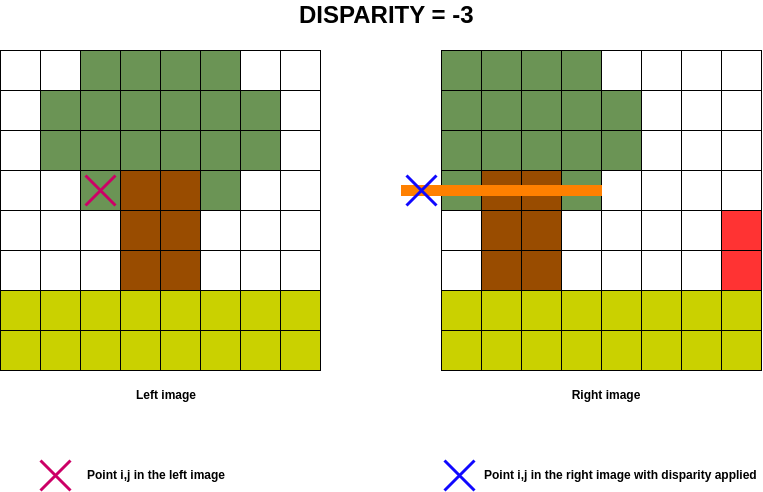
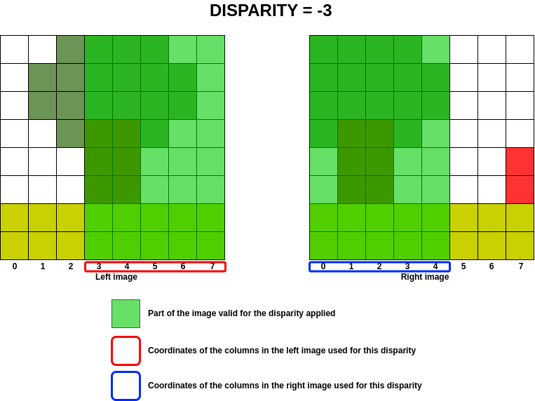
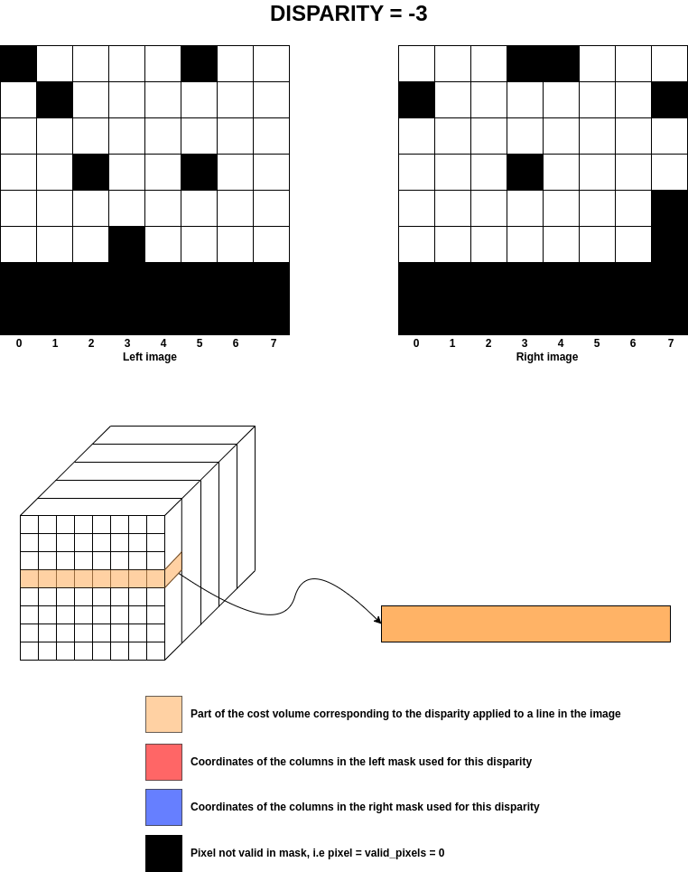

.. _cv_masked:

Masking of the cost volume calculated
=====================================

The cost volume, a 3D matrix (of size *n* x *m* x *p* where *n* x *m* is the size of the left and right images and 
*p* is the number of disparities) containing the similarity coefficients.
The cost volume is calculated during the :ref:`matching_cost` step by the selected similarity measure (SAD/SSD/CENSUS/ZNCC/MCCNN).

The cost volume is associated with a map of calculation validity indicators, i.e. the validity of the value of 
the similarity coefficients. These criteria are stored in a map `validity_mask`. Some are even pre-calculated 
before the similarity coefficients are obtained, see the page on :ref:`criteria`, and are those obtained by:

- minimum and maximum disparity
- no data in the left and right images
- invalid point in the left and right image mask

However, the invalid points present in the left and/or right masks for some disparities can only be taken into account once 
the cost volume has been calculated. The cost volume is calculated using a matrix product for optimisation purposes 
and would therefore replace the nan point values for some points and disparities.

The purpose of this page is to explain the `cv_masked` method, which adds nan in the cost volume corresponding to the invalid 
points present in the left and/or right masks.

Search for column coordinates based on disparity
************************************************
To better understand how the disparity search zone works, let's first look at what happens for a point :math:`Pi,j`. 

.. note::  For all the examples below, the disparity search interval is :math:`[-3, 1]`.

The animated image below shows the disparity search range in orange on the right-hand image for the :math:`Pi,j` point on the left. 
Note that for :math:`disparity = -3`, this is outside the image, so the cost volume is filled with np.nan for these exceptions 
(:math:`cost\_volume[i, j, -3] = np.nan`).

In order to optimise calculations in the cost volume, the aim is to determine which column of the left image will be 
present in the right image for a given disparity, given that the disparity implies a column shift on the right image.

In the previous example, we are looking to see which columns in the image on the left are present in the image on the 
right for a disparity between :math:`-3` and :math:`1`.

.. note::  A negative disparity implies a shift to the left on the right image and vice versa for a positive disparity. 
    For a null disparity, no shift is applied.

The following image shows the areas of the image on the left that can be treated for disparity and its equivalent in the image on the right.

At best, the range of columns treated for a given disparity corresponds to the following equations:

.. admonition:: Equations

    Equations to determine the first and last column coordinates as a function of disparity:

    - :math:`Coordinates_{Left} = (max(Idx_{begin} - disp, Idx_{begin}), min(Idx_{last} - disp, Idx_{last}))`
    - :math:`Coordinates_{Right} = (max(Jdx_{begin} + disp, Jdx_{begin}), min(Jdx_{last} + disp, Jdx_{last}))`

With, :math:`Idx` & :math:`Jdx` which correspond to the column coordinates of the left and right images respectively and :math:`disp` the current disparity.

.. admonition:: Example
    :class: important

    In our previous example, for a disparity of -1 :

    - :math:`Coordinates_{Left} = (max(0 - (-1), 0), min(7 - (-1), 7)) = (1, 7)`
    - :math:`Coordinates_{Right} = (max(0 + (-1), 0), min(7 + (-1), 7)) = (0, 6)`

These indices are used to match the marker in the left image to that in the right image for disparity :math:`-1`.

The subpixellic
---------------

In the matching cost step, the `subpix` parameter allows cost volume oversampling, i.e. testing floating values
between two integer disparities. For examples, with `subpix = 2` value `0.5` will be tested. With `subpix = 4`, 
values `0.25` and `0.75` will also be tested.

This introduces an offset of the right column image and therefore of these coordinates too, but only for the right image. 
This shift leads to a modification of the code, as the previous equations are no longer verified.

.. admonition:: Example
    :class: important

    In our previous example, for a disparity of :math:`-0.5` the left image has the same coordinates (i.e. :math:`[0, 1, 2, 3, 4, 5, 6, 7]` ) and the right image has new coordinates :math:`[-0.5, 0.5, 1.5, 2.5, 3.5, 4.5, 5.5, 6.5]` .
    
    With the above equations: 

    - :math:`\begin{aligned}Coordinates_{Left} &= (max(0 - (-0.5), 0),\ min(7 - (-0.5), 7)) \\ &= (0.5, 7)\end{aligned}`
    - :math:`\begin{aligned}Coordinates_{Right} &= (max(0.5 + (-0.5), 0.5),\ min(6.5 + (-0.5), 6.5)) \\ &= (0.5, 6)\end{aligned}`

    The expected result is:

    - :math:`Coordinates_{Left} = (1, 7)`
    - :math:`Coordinates_{Right} = (0.5, 6.5)`

In this case, a search for the nearest coordinate is carried out to obtain the correct range of left and right image coordinates.

.. code-block::

        if self._subpix != 1 :
            if disp < 0:
                `Coordinates{Left}{0}` = find_nearest_column(Coordinates{Left}{0}, Index{Left}, "+")
                `Coordinates{Right}{-1}` = find_nearest_column(Coordinates{Right}{-1}, Index{Right}, "+"))
            else:
                `Coordinates{Left}{-1}` = find_nearest_column(`Coordinates{Left}{-1}`, Index{Left}, "-"))
                `Coordinates{Right}{0}` = find_nearest_column(Coordinates{Right}{0}, Index{Right}, "-")

.. warning::  What was explained above is only valid in the classic case of Pandora, i.e. without the use of a step and a ROI.

The case of step
----------------

The use of a step in image processing can only be done via Pandora2D, see doc `matching cost Pandora2D`_.

This constraint means that the previous equations can no longer be used. In this case, the possible coordinates 
for the left image are those identified in the cost volume by the coordinates of the cost volume columns. 

Then, an increasing search starting from the first coordinate for a negative disparity, and a decreasing
search starting from the last coordinate for a positive disparity, is performed in order to obtain the correct interval.

Then, the formula :math:`Coordinates{Right} = Coordinates{Left} - disparity` is  applied.

.. _matching cost Pandora2D: https://pandora2d.readthedocs.io/en/latest/userguide/step_by_step/matching_cost.html

The case of ROI (Region of Interest)
------------------------------------

The ROI can be enabled by the user, if they use Pandora in library or notebook mode.

.. admonition:: Reminder

    The ROI configuration is as follows, see doc `Region of Interest Pandora2D`_.

    .. code-block::
    
        "ROI":
        {
            "col": {"first": <int>, "last": <int>},
            "row": {"first": <int>, "last": <int>}
        },

.. _Region of Interest Pandora2D: https://pandora2d.readthedocs.io/en/latest/userguide/roi.html

In this case, the coordinates of the left and right images no longer start at zero, but at `["row"]["first"]` and `["col"]["first"]`.
If the user provides the images or ROIs themselves, they must check that images or ROIs begin with the same coordinates.

Apply Left/Right masks on cost volume
*************************************

From the previous section, once the coordinates of the left and right images have been identified for a given disparity, 
the coefficients of the masks for those images are applied to the cost volume.

.. note::  A mask can contain different values, but in Pandora the valid pixel value is :math:`0`.

The masks supplied by the user are transformed into images containing :math:`0` and `NaN`, with :math:`0` being the valid pixels
and all other values are set to `NaN`.

For each disparity, the coordinates of the left and right images are calculated and those same coordinates 
are used for the masks to add NaNs to all the "invalid" pixels. 
The image below shows what happens for the previous example at disparity :math:`-3` for only one row.

.. warning::
    In the supixellic case, only one mask is calculated for `.5` , `.25` and `.75` disparity.

To summarise the diagram, the implementation of the `NaN` assertions is as follows:

.. admonition:: Equations
    
    - If :math:`P_{i,j} =` invalid pixel in left mask for disparity d, then :math:`cost\_volume_{i,j,d} = NaN` 
    - If :math:`Q_{i,j'} =` invalid pixel in right mask for disparity d, then :math:`cost\_volume_{i,j'-d,d} = NaN`
