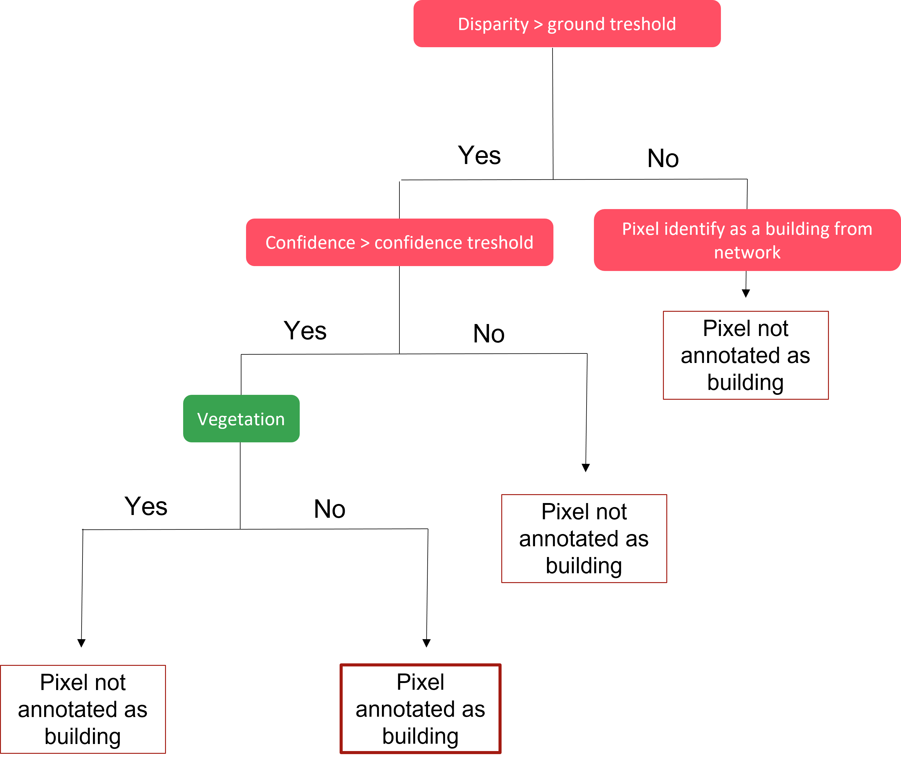
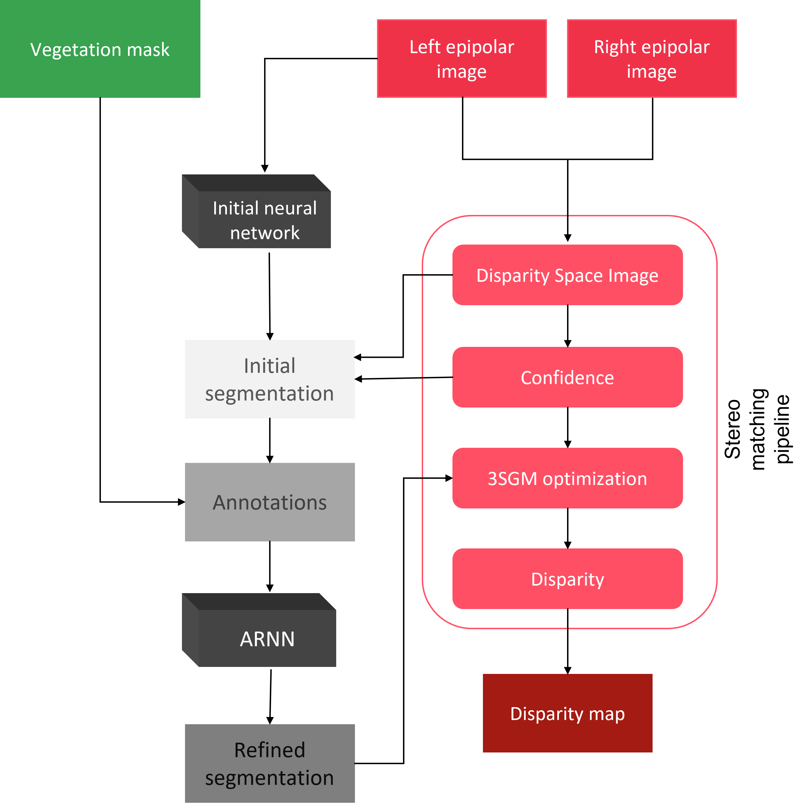

.. _plugin_arnn:

Plugin ARNN
===========

Theoretical basics
******************

`Pandora plugin <https://github.com/CNES/Pandora_plugin_arnn>`_ to compute building semantic segmentation.

**Goals**

In [Dumas2022ARNN]_, we show how the optimization step can benefit from an input building semantic segmentation.

The semantic segmentation is computed using a Convolutional Neural Network. The chosen neural network architecture (LinkNet) only takes
RGB as input channels. Hence we can assume it will try to detect building pixels mainly based on roof and neighborhood colors.
The network does not have a geometric notion for optimizing its loss.

To help our network generalize well on unseen areas, we use interactive learning
following the DISCA workflow [Lenczner2020]_ to refine the initial neural network (INN) and with it, its predictions.
In the DISCA workflow, annotations are manual clicks provided by an operator. To remove the need for a human-in-the-loop, we propose to automate the annotation process in the following section.

**Automatic annotations method**

The goal of this process is to identify and automatically annotate areas that have been misclassified. We will use a first version of the disparity map, a confidence map and a vegetation map.

A parameterizable disparity threshold is applied to a disparity map computed from a Disparity Space Image (DSI) that has yet to be optimized. The threshold helps differentiate between low and high disparities.
Disparities above the threshold are translated to building annotations. We then filter the building annotations to remove false positive on high vegetation areas using
a simple vegetation mask computed from the left epipolar image.

The following diagram explains the concept:

Our stereo pipeline: 3SGM optimization with labels from an Automatically Refined Neural Network (ARNN)

The following diagram explains the pipeline:

.. [Dumas2022ARNN] Dumas, L., Defonte, V., Steux, Y., and Sarrazin, E.: IMPROVING PAIRWISE DSM WITH 3SGM: A SEMANTIC SEGMENTATION FOR SGM USING AN AUTOMATICALLY REFINED NEURAL NETWORK, ISPRS Ann. Photogramm. Remote Sens. Spatial Inf. Sci., V-2-2022, 167–175, https://doi.org/10.5194/isprs-annals-V-2-2022-167-2022, 2022.
.. [Lenczner2020] Lenczner, G., Chan-Hon-Tong, A., Luminari, N., Saux, B. L., Besnerais, G. L., 2020. Interactive Learning for Semantic Segmentation in Earth Observation. arXiv preprint arXiv:2009.11250.

.. _plugin_arnn_conf:

Configuration and parameters
****************************

.. csv-table::

    **Name**,**Description**,**Type**,**Required**
    *RGB_bands*,Dictionary containing the RGB band name,dict,Yes
    *vegetation_band*,Dictionary containing a list of vegetation associated to "classes" key, dict,Yes

**Example**

.. sourcecode:: json

    {
      "input" : {
            // ...
      },
      "pipeline" :
       {
            // ...
            "semantic_segmentation": {
                "segmentation_method": "ARNN",
                "RGB_bands": {"R": "r", "G": "g", "B": "b"},
                "vegetation_band": {"classes" : ["olive tree", "forest"]}
            }
            // ...
       }
    }

.. note::
    * The semantic segmentation step should be specified in the json configuration file before the matching_cost step.
    * List all vegetation bands if they are all required for the vegetation mask.
