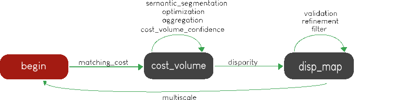
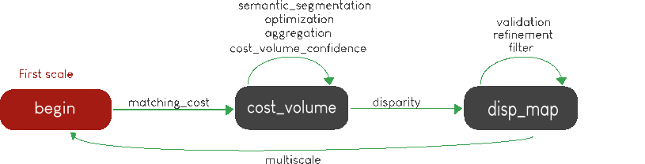

.. _Sequencing:

Sequencing
==========

Pandora will check if the requested steps sequencing is correct following the permitted
transition defined by the Pandora Machine (`transitions <https://github.com/pytransitions/transitions>`_)

The Pandora Machine is implemented using the GraphMachine from the transitions.extensions package if the Graphviz module
is available. Otherwise, the Pandora Machine is implemented using the Machine from the transitions package.

Pandora Machine defines 3 possible states:
 - begin
 - cost_volume
 - disparity_map

and 10 transitions, each one corresponding to a stereo step described in :ref:`step_by_step` chapter:
 - matching_cost (:ref:`matching_cost`)
 - semantic segmentation (:ref:`semantic_segmentation`)
 - aggregation (:ref:`cost_aggregation`)
 - optimization (:ref:`optimization`)
 - confidence (:ref:`cost_volume_confidence`)
 - disparity (:ref:`disparity`)
 - filter (:ref:`filter`)
 - refinement (:ref:`disparity_refinement`)
 - validation (:ref:`validation`)
 - multiscale (:ref:`multiscale`)

Pandora machine starts at the begin state. To go from a state to another one, transitions are called and triggered
by specific name. It corresponds to the name of Pandora steps you can write in configuration file.

The following diagram highlights all states and possible transitions.

    .. figure:: ../Images/Machine_state_diagram.png

A transition (i.e a pandora's step) can be triggered several times. You must respect the following
naming convention: *stepname.xxx*  where *xxx* can be the string you want.
See :ref:`multiple_filters_example` for an example with multiple usage of filter transition.

**The most important thing to remember is to build your configuration file following the previous diagram by using transition name on pipeline section of your file.**

**Checking configuration with the state machine:**

To ensure that the user configuration will work, we have chosen to activate twice the state machine.

First, we check the pipeline and build the complete configuration by adding the default parameters
if they have not been specified in the input configuration.

Between these two stages we use the `remove_transition` function in order to clean the state machine.

.. note::
    The transition version 0.9.0 contains a function that checks whether a future transition is available
    in the current state.
    That's why we had to rename triggers from the _transitions_check argument.

If you want to understand in more details how Pandora machine works, please consult our `Pandora machine state tutorial notebook <https://github.com/CNES/Pandora/tree/master/notebooks/...>`_.

Examples
********

SSD measurement and filtered disparity map
###########################################

Configuration to produce a disparity map, computed by SSD method, and filtered by
median filter method.

.. sourcecode:: json

    {
        "input":
        {
            "left": 
            {
                "mask": null,
                "disp": [-100, 100],
                "img": "img_left.png"
            },
            "right": 
            {
                "mask": null,
                "disp": null,
                "img": "img_right.png",
            }
        },
        "pipeline":
        {
            "matching_cost":
            {
                "matching_cost_method": "ssd",
                "window_size": 5,
                "subpix": 1
            },
            "disparity":
            {
                "disparity_method": "wta",
                "invalid_disparity": "NaN"
            },
            "filter":
            {
                "filter_method": "median"
            }
        }
    }

.. _right_map_example:

SSD measurement, filtered disparity map and compute right map
##############################################################

The same configuration as the previous example but right disparity map is also computed.

.. sourcecode:: json

    {
        "input":
        {
            "left": 
            {
                "mask": null,
                "disp": [-100, 100],
                "img": "img_left.png"
            },
            "right": 
            {
                "mask": null,
                "disp": null,
                "img": "img_right.png",
            }
        },
        "pipeline":
        {
            "matching_cost":
            {
                "matching_cost_method": "ssd",
                "window_size": 5,
                "subpix": 1
            },
            "disparity":
            {
                "disparity_method": "wta",
                "invalid_disparity": "NaN"
            },
            "filter":
            {
                "filter_method": "median"
            },
            "validation" :
            {
              "validation_method": "cross_checking_accurate"
            }
        }
    }

An impossible sequencing
########################

.. sourcecode:: json

    {
        "input":
        {
            "left": 
            {
                "mask": null,
                "disp": [-100, 100],
                "img": "img_left.png"
            },
            "right": 
            {
                "mask": null,
                "disp": null,
                "img": "img_right.png",
            }
        },
        "pipeline":
        {
            "matching_cost":
            {
                "matching_cost_method": "ssd",
                "window_size": 5,
                "subpix": 1
            },
            "filter":
            {
                "filter_method": "median"
            }
            "disparity":
            {
                "disparity_method": "wta",
                "invalid_disparity": "NaN"
            },
            "filter":
            {
                "filter_method": "median"
            }
        }
    }

With this configuration, you receive the following error

.. sourcecode:: text

    Problem during Pandora checking configuration steps sequencing. Check your configuration file.
    (...)
    transitions.core.MachineError: "Can't trigger event filter from state cost_volume!"

Before the start, Pandora Machine is in the "begin" state. The configuration file defines *matching_cost* as
the first step to be triggered. So, Pandora Machine go from *begin* state to *cost_volume* state.
Next, the *filter* is going to be triggered but this is not possible. This step can be triggered only
if the Pandora Machine is in *disp_map*.

.. _multiple_filters_example:

Same step, multiple times
#########################

.. sourcecode:: json

    {
        "input": {
            "left": 
            {
                "mask": null,
                "disp": [-100, 100],
                "img": "img_left.png"
            },
            "right": 
            {
                "mask": null,
                "disp": null,
                "img": "img_right.png",
            }
        },
        "pipeline":
        {
            "matching_cost":
            {
                "matching_cost_method": "ssd",
                "window_size": 5,
                "subpix": 1
            },
            "disparity":
            {
                "disparity_method": "wta",
                "invalid_disparity": "NaN"
            },
            "filter.1":
            {
                "filter_method": "median"
            }
            "filter.2":
            {
                "filter_method": "bilateral"
            }
        }
    }

Multiscale
#########################################

Configuration to produce a disparity map, computed by SSD method with multiscale processing (3 scales)

.. sourcecode:: json

    {
        "input":
        {
            "left": 
            {
                "mask": null,
                "disp": [-100, 100],
                "img": "img_left.png"
            },
            "right": 
            {
                "mask": null,
                "disp": null,
                "img": "img_right.png",
            }
        },
        "pipeline":
        {
            "matching_cost":
            {
                "matching_cost_method": "ssd",
                "window_size": 5,
                "subpix": 1
            },
            "disparity":
            {
                "disparity_method": "wta",
                "invalid_disparity": "NaN"
            },
            "multiscale": {
                "multiscale_method": "fixed_zoom_pyramid",
                "num_scales": 3
            }
        }
    }

